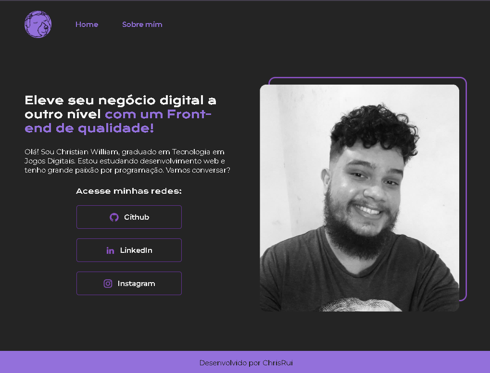

# Criação de Portfolio

Um pagina com um portfolio simples e responsivo;

## 🔨 Funcionalidades do projeto

Nesse projeto, foi criado uma página com um modelo de portfolio, na pagina home, há quatro elementos princípais, um titulo, uma breve descrição, links para as redes sociais, e uma foto em preto e branco, logo a direita do texto dirieta. E uma outra página "Sobre mim" onde a um modelo de texto escrito com "Mussum Ipsum"

## ✔️ Técnicas e tecnologias utilizadas

As técnicas e tecnologias utilizadas pra isso são:

- `HTML`: Foi realiazo a estrutura da página.
- `CSS`: Foi feito a estilização da página, com preferência ao uso de cores roxas.

  

  
  
  

## 📁 Acesso ao projeto

Você pode [baixar o arquivo zip](https://github.com/Christian-Rui/portfolio/archive/refs/heads/main.zip).

## 🛠️ Abrir e rodar o projeto

Após baixar o projeto, você pode abrir com o Visual Studio Code para acessa-lo e modificar o código. Para isso, na tela inicial clique em:

- **Open Folder** (ou alguma opção similar)
- Procure o local onde o projeto está e o selecione (Caso o projeto seja baixado via zip, é necessário extraí-lo antes de procurá-lo)
- Por fim clique em OK

Para  abrir, basta clicar duas vezes no arquivo **index.html** que ele será aberto no seu navegador, e você poderá testar suas funcionalidades

